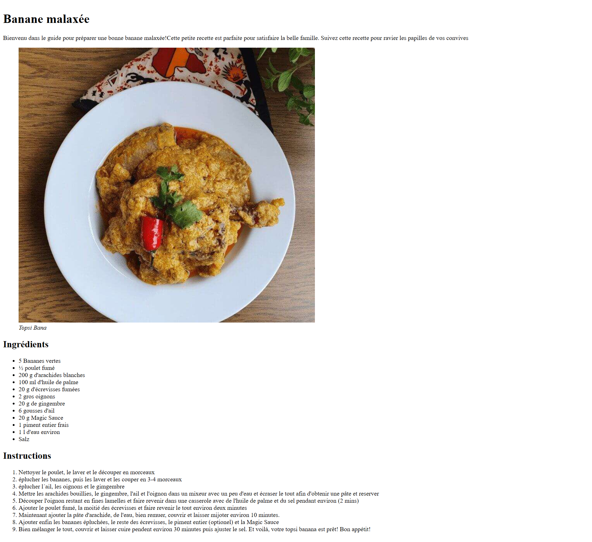

# ��� Recipe Page

## ��� Description
Page de recette de cuisine avec liste d'ingrédients et étapes de préparation.

## ��� Objectifs
- Structurer du contenu avec listes ordonnées et non-ordonnées
- Organiser l'information de manière claire
- Utiliser les balises sémantiques appropriées

## ���️ Technologies
- HTML5

## ��� Ce que j'ai appris
- Différence entre `<ul>` (liste non-ordonnée) et `<ol>` (liste ordonnée)
- Organisation logique du contenu
- Structure d'une page informative

## ��� Screenshot

## ��� Live Demo
[Voir en ligne](https://ton-username.github.io/freeCodeCamp-30Day-Challenge/week-X/nom-projet)

## ��� Contexte
Projet 2/12 - freeCodeCamp 30-Day Challenge (Jour 1 - 05 Nov 2025)

---
[← Retour au challenge](../../README.md)
