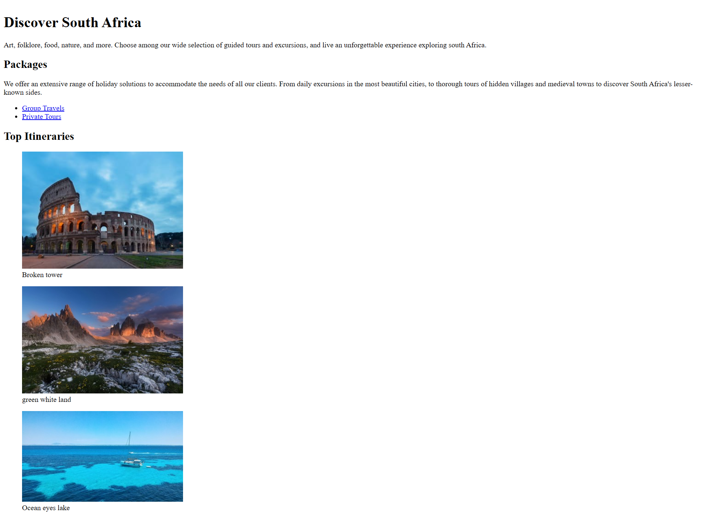

# ✈️ Travel Agency Page

## ��� Description
Page d'agence de voyage présentant des destinations avec descriptions et informations.

## ��� Objectifs
- Organiser plusieurs sections
- Utiliser meta tags pour SEO

## ���️ Technologies
- HTML5

## ��� Ce que j'ai appris
- Meta tags (description, Open Graph)
- Structure multi-sections
- Organisation de contenu commercial

## ��� Screenshot

## ��� Live Demo
[Voir en ligne](https://ton-christ-yvan.github.io/freeCodeCamp-30Day-Challenge/week-X/nom-projet)

## ��� Contexte
Projet 3/12 - freeCodeCamp 30-Day Challenge (Jour [05 Nov 2025])

---
[← Retour au challenge](../../README.md)
